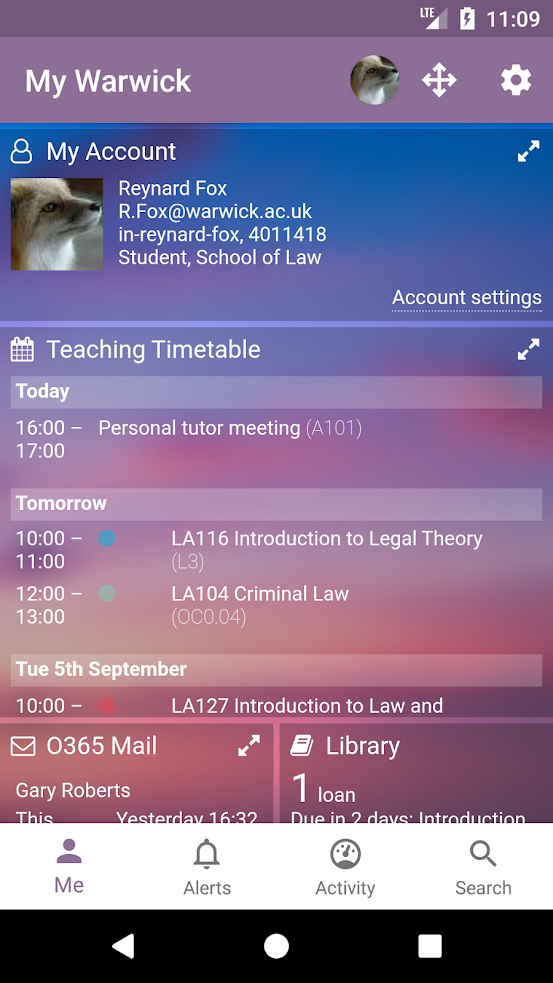

My Warwick for Android
======================

This is My Warwick for Android. My Warwick is the University of Warwick's mobile application for students.

> My Warwick brings together information about many aspects of student life at Warwick, pulling data out of the systems used for timetabling, coursework, learning content, news and events, etc, and putting everything you need to know into a single place. It can be used to view your teaching timetable, keep on top of your coursework deadlines, check your emails and calendar, get bus times and traffic alerts, see a weather forecast, and more.

> My Warwick sends you alerts when something needs your attention. You'll get an alert when an assignment deadline is approaching, a library book is due back soon, and so on. Your department can send you alerts if a lecture is moved or cancelled. And every time you receive an alert, you can choose whether you want more alerts like that in future. So you're always in control of what's sent to you.

Architecture
------------

My Warwick is a web application written with React on the frontend, and Scala/Play on the backend. The mobile apps are primarily thin wrappers around the web application, with some added native functionality. The web app will try to present components to the user that are recognisable for their platform. As an example, Android users will see material-style switches in the settings menu.

The Android application has more native functionality than the iOS app. For instance, the top app bar is implemented natively. Transient 2FA notifications support copy to clipboard. Opening links uses the Custom Tabs protocol, supported by popular browsers including Firefox for Android as well as pre-installed browsers such as Chrome. Currently, we implement all native logic in Java.

We have a [Play store](https://play.google.com/store/apps/details?id=uk.ac.warwick.my.app&hl=en) listing.

BrowserStack
------------

BrowserStack provides instant access to 2000+ browsers and real iOS and Android devices for cross browser/device testing.

This project has been tested for cross-device support using access provided by BrowserStack's open source programme.

This project uses BrowserStack for testing the My Warwick Android app on a wide range of Android devices.

